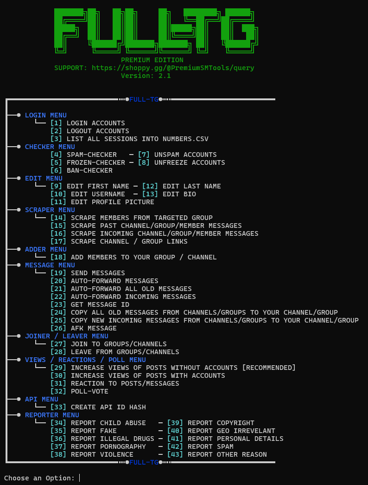

# Telegram-Auto-Messaging
TG tool mady in Python, fully working with many other functions. Easy to use for beginners.

## GET TOOL HERE: https://shorturl.at/yxWGr
Contact us for any inquiries: https://shorturl.at/ZJHUf
### All functions:

#### ✅ What is a Telegram Mass DM Tool?

A Telegram Mass DM Tool is automated software that sends direct messages to multiple Telegram users simultaneously. This eliminates the tedious process of manual messaging, saving you countless hours while maximizing your outreach efficiency.

Key capabilities include:
- Sending messages to users from specific groups or channels
- Personalizing content using customizable templates
- Operating multiple accounts to expand your reach
- Configurable timing and limits to maintain account safety

#### 💡 Why Use a Telegram Bulk Messaging Tool?

Direct messaging remains one of Telegram's most powerful engagement strategies. Whether you're promoting services or growing communities, here's why mass messaging delivers results:

- **Direct User Engagement:** Connect with users personally through private chats
- **Maximum Visibility:** DMs achieve higher open rates than group messages or broadcasts
- **Personalized Communication:** Customize messages with variables for better engagement
- **Scalable Campaigns:** Reach hundreds or thousands of users automatically
- **Cost-Efficient Marketing:** Achieve results without advertising budgets

#### 📈 Practical Applications

This tool serves multiple purposes:
- **Product Launches:** Directly announce new offerings to interested audiences
- **Event Marketing:** Drive registrations by messaging potential attendees
- **Community Growth:** Invite users to join your groups, channels, or forums
- **Lead Nurturing:** Follow up with users from exported lists or past interactions
- **Affiliate Marketing:** Deliver targeted offers to high-potential users

We continuously implement requested features!
For any questions, don't hesitate to reach out.

## GET TOOL HERE: https://shorturl.at/yxWGr
Contact us for any inquiries: https://shorturl.at/ZJHUf
